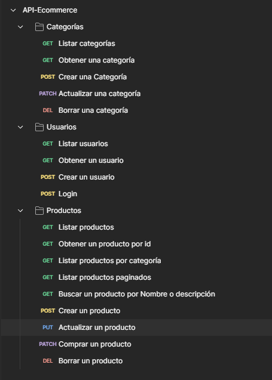

# API E-Commerce con ASP.NET Core

[English version](README.en.md)

API REST para administrar el catálogo de un comercio electrónico. Permite gestionar categorías, productos y usuarios; incluye autenticación JWT, autorización por roles, versionado de API, carga de imágenes, paginación y datos iniciales.

**API desplegada:** [Azure App Service](https://ecommerce-api-bzhxamaredawf4d4.mexicocentral-01.azurewebsites.net)

**Pruebas públicas:** [Listar categorías](https://ecommerce-api-bzhxamaredawf4d4.mexicocentral-01.azurewebsites.net/api/v1/Categories) | [Listar productos](https://ecommerce-api-bzhxamaredawf4d4.mexicocentral-01.azurewebsites.net/api/v1/Products)

**Colección de pruebas:** [API-Ecommerce.postman_collection.json](API-Ecommerce.postman_collection.json)

### Crear un usuario de prueba

Cualquier visitante puede registrar su propio usuario con el rol `User`:

```http
POST https://ecommerce-api-bzhxamaredawf4d4.mexicocentral-01.azurewebsites.net/api/v1/Users
Content-Type: application/json
```

```json
{
  "name": "Usuario Demo",
  "userName": "correo-unico@example.com",
  "password": "CambiaEstaClave123!",
  "role": "User"
}
```

Después puede iniciar sesión mediante `POST /api/v1/Users/Login` para obtener su JWT. El servidor asigna siempre el rol `User`, independientemente del valor enviado en `role`.

## Funcionalidades

- CRUD de categorías y productos.
- Registro, consulta e inicio de sesión de usuarios.
- Autenticación mediante JSON Web Tokens.
- Autorización con roles `Admin` y `User`.
- ASP.NET Core Identity para usuarios, contraseñas y roles.
- Versionado de categorías mediante rutas `v1` y `v2`.
- Búsqueda de productos por nombre o descripción.
- Filtrado de productos por categoría.
- Paginación de productos.
- Control y reducción de existencias al comprar.
- Carga de imágenes mediante `multipart/form-data`.
- Publicación de imágenes como archivos estáticos.
- Mapeo entre entidades y DTOs con Mapster.
- Persistencia en SQL Server con Entity Framework Core.
- Datos iniciales para roles, categorías, productos y usuarios.
- Caché de respuestas para consultas de categorías.
- Documentación OpenAPI y Swagger en desarrollo.
- Colección de Postman para probar los endpoints.
- Despliegue en Azure App Service con Azure SQL Database.

## Arquitectura

El proyecto utiliza una organización por capas junto con Repository Pattern. El flujo general de una solicitud es:

```text
Cliente HTTP
    |
    v
Controller
    |
    +-- DTO de entrada/salida
    +-- Mapster
    |
    v
Interfaz del repositorio
    |
    v
Repositorio
    |
    v
ApplicationDbContext / Entity Framework Core
    |
    v
SQL Server
```

### Responsabilidades

- **Controllers:** definen las rutas, reciben solicitudes, validan los datos, coordinan los repositorios y construyen las respuestas HTTP.
- **DTOs:** controlan los datos que entran y salen de la API sin exponer directamente las entidades.
- **Mapping:** contiene la configuración de Mapster para transformar DTOs, entidades y respuestas.
- **Repository/IRepository:** las interfaces definen los contratos y los repositorios implementan las consultas y operaciones de persistencia.
- **Models:** representan las entidades `Category`, `Product` y `ApplicationUser`.
- **Data:** contiene el contexto de Entity Framework Core y la carga de datos iniciales.
- **Migrations:** mantiene el historial de cambios del esquema de SQL Server.
- **Constants:** centraliza nombres de políticas y perfiles de caché.
- **Program.cs:** configura dependencias, base de datos, Identity, JWT, versionado, CORS, caché, Swagger y middleware.

## Modelo de datos

### Category

Representa una categoría del catálogo.

- `IdCategory`
- `Name`
- `CreationDate`

### Product

Representa un producto y pertenece a una categoría.

- `ProductId`
- `Name`
- `Description`
- `Price`
- `SKU`
- `Stock`
- `ImgUrl`
- `ImgUrlLocal`
- `CreationDate`
- `UpdateDate`
- `CategoryId`

La relación es **Category 1:N Product**. Entity Framework Core utiliza `CategoryId` como llave foránea y `Category` como propiedad de navegación.

### ApplicationUser

Extiende `IdentityUser` y agrega el nombre de la persona. Identity administra el identificador, nombre de usuario, correo, hash de contraseña, roles y demás información de seguridad.

## DTOs y mapeo

La API usa DTOs diferentes según cada operación:

- `CategoryDto` y `CreateCategoryDto`.
- `ProductDto`, `CreateProductDto` y `UpdateProductDto`.
- `CreateUserDto`, `UserDto` y `UserDataDto`.
- `UserLoginDto` y `UserLoginResponseDto`.
- `PaginationResponse<T>` para resultados paginados.

Mapster registra los mapeos al iniciar la aplicación. Los perfiles convierten categorías, productos y usuarios sin inyectar un mapper en cada controlador. En productos también se obtiene `CategoryName` desde la relación con `Category`.

## Reglas y validaciones

- No se crean categorías o productos con un nombre ya registrado.
- El nombre de una categoría es obligatorio y debe tener entre 3 y 50 caracteres.
- Un producto solo puede crearse o actualizarse con una categoría existente.
- El precio y el stock no admiten valores negativos.
- Una compra requiere una cantidad positiva y existencias suficientes.
- Cada registro público recibe el rol `User`, aunque el cliente envíe otro valor.
- Las operaciones de escritura del catálogo y las consultas de usuarios requieren el rol `Admin`.
- Los controladores devuelven respuestas HTTP como `200 OK`, `201 Created`, `204 No Content`, `400 Bad Request`, `401 Unauthorized`, `403 Forbidden` y `404 Not Found`, según el resultado.

## Autenticación y autorización

El registro y el login son públicos. Al iniciar sesión correctamente, la API genera un JWT firmado con HMAC SHA-256 y una duración de dos horas.

El token contiene:

- Identificador del usuario.
- Nombre de usuario.
- Rol.

Los endpoints administrativos requieren:

```http
Authorization: Bearer <token>
```

Los nuevos registros reciben siempre el rol `User`. El rol no se toma del cuerpo enviado por el cliente. Los administradores se crean de forma controlada.

## Versionado

Las categorías tienen dos versiones:

- `/api/v1/Categories`: primera versión; el listado está marcado como obsoleto.
- `/api/v2/Categories`: listado actualizado y ordenado por identificador.

Productos y usuarios son neutrales a la versión, pero conservan el segmento de versión en sus rutas:

```text
/api/v1/Products
/api/v1/Users
```

## Endpoints principales

Base URL:

```text
https://ecommerce-api-bzhxamaredawf4d4.mexicocentral-01.azurewebsites.net
```

### Categorías

| Método | Ruta | Acceso | Descripción |
| --- | --- | --- | --- |
| GET | `/api/v1/Categories` | Público | Lista las categorías |
| GET | `/api/v1/Categories/{id}` | Público | Obtiene una categoría |
| POST | `/api/v1/Categories` | Admin | Crea una categoría |
| PATCH | `/api/v1/Categories/{id}` | Admin | Actualiza una categoría |
| DELETE | `/api/v1/Categories/{id}` | Admin | Elimina una categoría |
| GET | `/api/v2/Categories` | Público | Lista las categorías con el comportamiento de v2 |

### Productos

| Método | Ruta | Acceso | Descripción |
| --- | --- | --- | --- |
| GET | `/api/v1/Products` | Público | Lista todos los productos |
| GET | `/api/v1/Products/{id}` | Público | Obtiene un producto |
| GET | `/api/v1/Products/Paged?pageNumber=1&pageSize=5` | Público | Lista productos paginados |
| GET | `/api/v1/Products/searchProductByCategory/{categoryId}` | Público | Filtra por categoría |
| GET | `/api/v1/Products/searchProductByNameDescription/{term}` | Público | Busca por nombre o descripción |
| POST | `/api/v1/Products` | Admin | Crea un producto |
| PUT | `/api/v1/Products/{id}` | Admin | Actualiza un producto |
| PATCH | `/api/v1/Products/buyProduct/{name}/{quantity}` | Admin | Reduce el stock |
| DELETE | `/api/v1/Products/{id}` | Admin | Elimina un producto |

La creación y actualización de productos reciben `multipart/form-data` para admitir una imagen opcional.

La respuesta paginada contiene `pageNumber`, `pageSize`, `totalPages` e `items`.

### Usuarios

| Método | Ruta | Acceso | Descripción |
| --- | --- | --- | --- |
| GET | `/api/v1/Users` | Admin | Lista los usuarios |
| GET | `/api/v1/Users/{id}` | Admin | Obtiene un usuario |
| POST | `/api/v1/Users` | Público | Registra un usuario con rol `User` |
| POST | `/api/v1/Users/Login` | Público | Valida credenciales y devuelve el JWT |

## Datos iniciales

El proceso de seeding se ejecuta junto con Entity Framework Core y agrega, cuando corresponde:

- Roles `Admin` y `User`.
- Categorías del catálogo.
- Productos de ejemplo.
- Usuario regular.
- Administrador inicial con una contraseña obtenida desde la configuración, nunca escrita directamente en el repositorio.

## Tecnologías

| Área | Tecnología |
| --- | --- |
| Framework | .NET 10, ASP.NET Core Web API |
| Persistencia | Entity Framework Core 10 |
| Base de datos | SQL Server, Azure SQL Database |
| Seguridad | ASP.NET Core Identity, JWT Bearer |
| Mapeo | Mapster |
| Versionado | Asp.Versioning.Mvc |
| Documentación | OpenAPI, Swagger / Swashbuckle |
| Pruebas manuales | Postman |
| Contenedores | Docker Compose, SQL Server 2022 |
| Despliegue | Azure App Service |

## Estructura del proyecto

```text
ApiEcommerce/
|-- Constants/
|-- Controllers/
|   |-- V1/
|   |-- V2/
|-- Data/
|-- Mapping/
|-- Migrations/
|-- Models/
|   |-- DTOs/
|       |-- Responses/
|-- Repository/
|   |-- IRepository/
|-- wwwroot/
|   |-- ProductsImages/
|-- Program.cs
|-- docker-compose.yml
|-- API-Ecommerce.postman_collection.json
```

## Configuración

La aplicación necesita estas claves. En producción deben configurarse como variables de entorno o valores de configuración de Azure App Service.

| Variable | Uso |
| --- | --- |
| `ConnectionStrings__ConexionSql` | Conexión con SQL Server |
| `ApiSettings__SecretKey` | Firma y validación de tokens JWT |
| `SeedAdmin__Password` | Contraseña del administrador inicial |
| `MSSQL_SA_PASSWORD` | Contraseña del contenedor local de SQL Server |

Ejemplo sin credenciales reales:

```json
{
  "ApiSettings": {
    "SecretKey": "una-clave-larga-y-privada"
  },
  "ConnectionStrings": {
    "ConexionSql": "Server=localhost;Database=ApiEcommerceNET;User ID=SA;Password=TU_PASSWORD;TrustServerCertificate=true"
  }
}
```

## Ejecución local

Requisitos:

- .NET 10 SDK.
- SQL Server o Docker.
- Herramientas de Entity Framework Core.

```bash
dotnet restore
docker compose up -d
dotnet ef database update
dotnet run
```

En desarrollo, Swagger está disponible en:

```text
http://localhost:5163/swagger
```

## Postman

Importa [API-Ecommerce.postman_collection.json](API-Ecommerce.postman_collection.json) en Postman. Primero registra o inicia sesión con un usuario autorizado y utiliza el JWT en las solicitudes protegidas.

La colección agrupa las solicitudes por categorías, usuarios y productos:



Antes de publicar cambios en la colección, elimina tokens y contraseñas reales de los ejemplos exportados.

## Despliegue

La API está publicada en Azure App Service y utiliza Azure SQL Database. La cadena de conexión, la clave JWT y la contraseña del administrador inicial se administran desde las variables de entorno del servicio.


## Autor

**Yuviny Emanuel Velásquez González**

- [GitHub](https://github.com/Emanuel4848)
- [LinkedIn](https://www.linkedin.com/in/yuviny-gonzalez)
